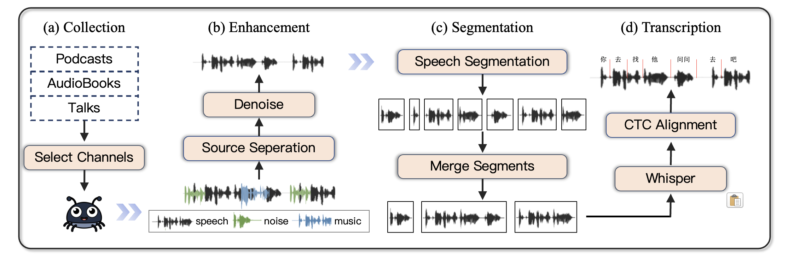

# speech-processing-pipeline

<p align="center">
    
<p>

* 本仓库致力于构建高质量语音数据集的 pipeline，包含数据抓取、人声抽取、降噪、转录等关键步骤。

* 我们基于这套 pipeline 清洗了 10,000+ 小时的完整有声书音频，支持语音相关的多种下游任务：音频编码器、TTS、Speech Generation 等等，欢迎大家用于相关研究！


## 📚 数据下载

1. 环境准备：数据下载主要依赖于 `yt-dlp` 库。

2. 文件准备：《有声书2.xlsx》 表格中包含了900多本来自于 Bilibili 和 Youtube 的有声书链接；

3. 下载 Bilibili / Youtube 音频：

   * 如果已经下载一部分书籍，可以将书名按行写入 downloaded_book.txt 中标记；

   * 执行 `python download_youtube_book.py` ，该脚本会下载表格中未下载的 Youtube 声书，下载内容会按照如下格式写入 `audiobook/` 目录中：

     ```bash
     ./
     ├── 150部著名短篇小说简介
     │   ├── 1.opus
     │   ├── 2.opus
     │   └── 3.opus
     ├── 一生
     │   ├── 1.opus
     │   └── 2.opus
     ...
     ```

   * 同理，执行 `python download_bilibili_book.py` ，该脚本会下载表格中未下载的 Bilibili 声书


## 🤖 数据清洗

清洗原则：预训练阶段的数据尽可能洗干净，后面如果想要增强模型的鲁棒性，可以再对训练数据添加噪声，进行数据增强。这样的好处在于预训练数据还可以用来做 TTS 之类的其他任务。

> ASR 任务的话数据可以脏一点，增强鲁棒性，TTS 相反，希望生成干净的数据。


### 环境依赖

**安装 whisperx**

```bash
# 新建立一个虚拟环境
conda create -n whisperx python=3.10

# 安装依赖项
pip install torch==2.0.0 torchaudio==2.0.0
pip install ctranslate2==4.4.0 numpy==1.24.3

pip install whisperx==3.2.0
```


**本地运行pyannote**

下载 [pyannote_model_wespeaker-voxceleb-resnet34-LM.bin](https://modelscope.cn/models/pyannote/wespeaker-voxceleb-resnet34-LM/resolve/master/pytorch_model.bin) 和 [pyannote_model_segmentation-3.0.bin](https://modelscope.cn/models/pyannote/segmentation-3.0/resolve/master/pytorch_model.bin) 到根目录下的 `./models` 中，创建 `./models/pyannote_diarization_config.yaml`

```yaml
version: 3.1.0

pipeline:
  name: pyannote.audio.pipelines.SpeakerDiarization
  params:
    clustering: AgglomerativeClustering
    embedding: models/pyannote_model_wespeaker-voxceleb-resnet34-LM.bin 
    embedding_batch_size: 32
    embedding_exclude_overlap: true
    segmentation: models/pyannote_model_segmentation-3.0.bin  
    segmentation_batch_size: 32

params:
  clustering:
    method: centroid
    min_cluster_size: 12
    threshold: 0.7045654963945799
  segmentation:
    min_duration_off: 0.0
```

> 注意: 文件路径和命名不能改！！！

修改 whisperx 源码 `diarize.py`:
```python
import os
from pathlib import Path

def load_pipeline_from_pretrained(path_to_config: str | Path) -> Pipeline:
    path_to_config = Path(path_to_config)

    print(f"Loading pyannote pipeline from {path_to_config}...")

    cwd = Path.cwd().resolve() 

    cd_to = path_to_config.parent.parent.resolve()

    print(f"Changing working directory to {cd_to}")
    os.chdir(cd_to)

    pipeline = Pipeline.from_pretrained(path_to_config)

    print(f"Changing working directory back to {cwd}")
    os.chdir(cwd)

    return pipeline


class DiarizationPipeline:
    def __init__(
        self,
        model_name="models/pyannote_diarization_config.yaml",
        use_auth_token=None,
        device: Optional[Union[str, torch.device]] = "cpu",
    ):
        if isinstance(device, str):
            device = torch.device(device)
        # self.model = Pipeline.from_pretrained(model_name, use_auth_token=use_auth_token).to(device)
        self.model = load_pipeline_from_pretrained(model_name).to(device)
```


**安装 Demucs**

建议从源码安装到根目录：
```bash
git clone https://github.com/adefossez/demucs.git
cd demucs
pip install -e .
```


### 音频增强

原始抓取的音频中可能包含背景音乐或者其他的噪声，为此我们首先需要从中抽取出干净的人声。


#### 分离背景音乐

分离背景音乐采用 [Demucs4](https://github.com/adefossez/demucs) 模型，相比于 Stem2 它的效果更好，但是效率也会慢一点。不过好处在于 Demucs 模型可以直接支持长音频的处理，不需要像 Stem2 那样手动切割音频，分成小份处理。

音频处理脚本在 `data_collactor/demucs.py` 。在执行该脚本之前，为了利用多张GPU资源，需要首先将待处理文件手动划分成多份。同时也需要注意 CPU 的负载，可以通过 `lscpu` 命令查看 NUMA 节点的分区情况。根据分区数目和GPU数目（两者最小的值）来确定划分数量：

```bash
python data_collactor/split_demucs_tasks.py
```

如果已经处理了一部分文件，可以将处理后的书名写入 `processed_data/done.txt` 文件中。

该脚本会将剩余的书名分成多份，分别写入 `./tasks` 目录下的 txt 文件中。


随后，通过 `taskset` 指定进程调用的 CPU 核，避免不同进程之间产生资源争抢的问题：

```bash
taskset -c 48-71 python -m data_collactor.demucs --gpu 2 --task-file tasks/gpu_2_tasks.txt
```

这行命令会启用 48-71 的 CPU 核，在 GPU2 上执行背景音分离脚本，处理 tasks/gpu_2_tasks.txt 中的文件。

> 尽管如此，一些情况下进程仍然会出现 killed 的问题，出现该问题极有可能是重采样部分代码导致的。
>
> 如果这种情况出现的话，就重新执行上述命令即可。


**[Update]** 重采样已换成 soxr 进行处理，效果更稳定。如果 GPU 内存很足，也可以考虑使用 torchaudio，这两个的处理速度都很快。


#### 降噪

降噪采用的是估算的 SNR 值，如果 SNR 低于 15dB，则会调用降噪模型。这里选择 [DeepFilterNet](https://github.com/Rikorose/DeepFilterNet) 作为降噪模型。

降噪不需要并行，因为绝大多文件的 SNR 都远高于 15dB，有声书是专业的录音设备，音频质量比较好。

这种情况下直接运行 `denoise.py` 即可：

```bash
python data_collactor/denoise.py
```


### 人声分割

#### 音频切分

人声分割没有使用 VAD，而是直接采用 pyannote 进行细粒度切分，核心脚本在 `data_collactor/segment.py`。

考虑到 CPU 的资源调用，这里同样使用 `taskset` 来约束单个进程调用的 CPU 核。

为此，首先需要将待分割音频划分成多份，写入 file_lists 目录中，比如 `file_lists/files_gpu_1.txt` ，每一行是单个 vocals.wav 的路径。

然后执行下面的命令来进行人声分割：
```bash
taskset -c 0-23 python data_collactor/segment.py --gpu 0 --file-list file_lists/files_gpu_0.txt --root-dir processed_data/audiobook_vocal_20250120 --output temp_20250120_195855/segments_gpu_0.csv 2>&1 | tee segment_0.out
```

该脚本会以追加的形式向指定 csv 文件写入分割的 segment 信息，包含源文件路径以及起止时间戳。


#### 片段聚合

上述脚本的分割结果是最小片段，接下来还需要根据需要对片段进行聚合。

聚合原理很简单，如果相邻的片段属于同一个 Speaker，并且片段的时间间隔低于设定的阈值，那么就合并到一句话中。需要注意，为了尽可能利用到多的音频数据，我们还设置了一个最长音频限制 `max_len`。也就是说，在合并音频的时候，如何合并后的音频片段长度超过了 `max_len` ，那么就终止合并，让后续音频开启新的片段。

这里 `max_len` 的参数值设置为 300，对应了预训练阶段的音频最大时长。

这部分功能的实现在脚本 `data_collactor/merge_segments.py` 中：

```bash
python data_collactor/merge_segments.py
```


执行脚本之后会在 processed_data 目录下看到很多间隔阈值对应的切分片段时长统计。选择合适的那个文件，执行下面的脚本进行切割，保存到 processed_data 下一个新的二级目录中。

```BASH
python data_collactor/rewrite_segments.py
```


> 为了选择合适音频间隔，可以执行 plot.py 来绘制不同音频区间上样本的总时长。
>
> 理想情况下，我们期望低于某个duration的区间音频总时长占比相对较低，同时这个 duration 的阈值可以比较高。比如，我们希望 30s 以内的音频总时长占比可以低于10%。这样可以确保我们有足够多的长音频用于训练。


### 音频转录

音频转录采用的是 [faster-whisper-large-v3](https://modelscope.cn/models/keepitsimple/faster-whisper-large-v3) 模型，转录完之后需要进行文本正则化。因为直接转录的文本中可能包含很多阿拉伯数字以及%等特殊符号，这些会影响到后续的 CTC 对齐。

文本正则化之后使用 wav2vec2.0 来进行 CTC 强制对齐。这里选用[中文数据集上微调后的 wav2vec 模型](https://modelscope.cn/models/jonatasgrosman/wav2vec2-large-xlsr-53-chinese-zh-cn)。

整个音频转录流程实现在 transcribe.py 脚本中，执行以下指令运行：
```bash
CUDA_VISIBLE_DEVICES=0 python data_collactor/transcribe.py \
    --input_dir processed_data \
    --segments_file processed_data/segments_ag \
    --output_jsonl processed_data/transcriptions/output_gpu0.jsonl \
    --batch_size 64 \
    --compute_type float16
```

这里是手动将需要处理的音频片段分割成了多片，并行处理。

可以通过下面这行命令，将目标文件中的待处理音频划分成多个待处理列表，5300是每个进程要处理的文件数目:
```bash
find audiobook_vocal_20250212_segments_2.2_min_60_max_300/ -type f | sort | split -l 5300 - segments_
```


